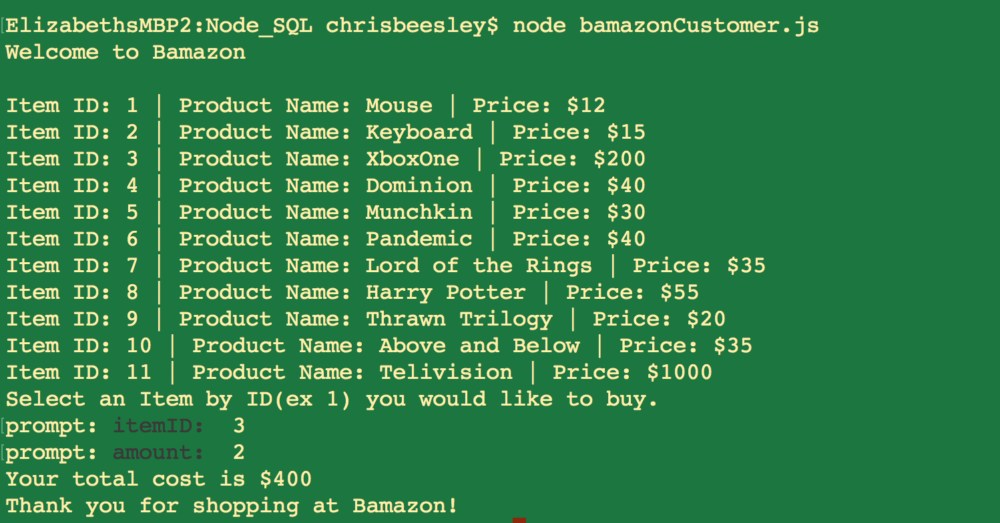
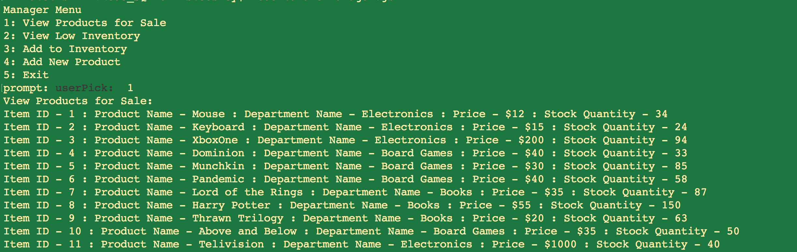
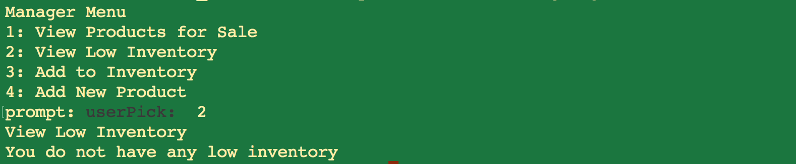
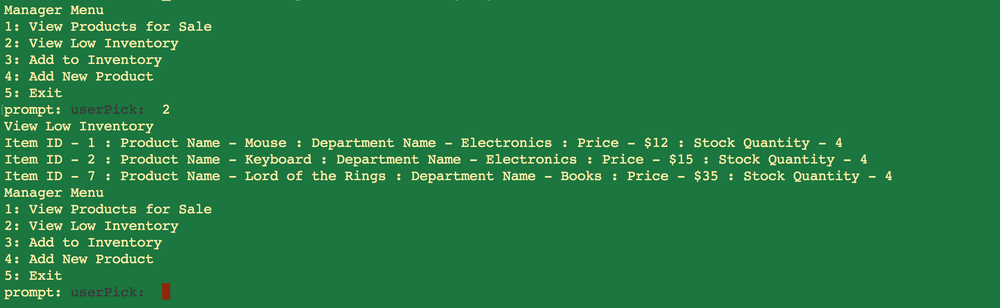
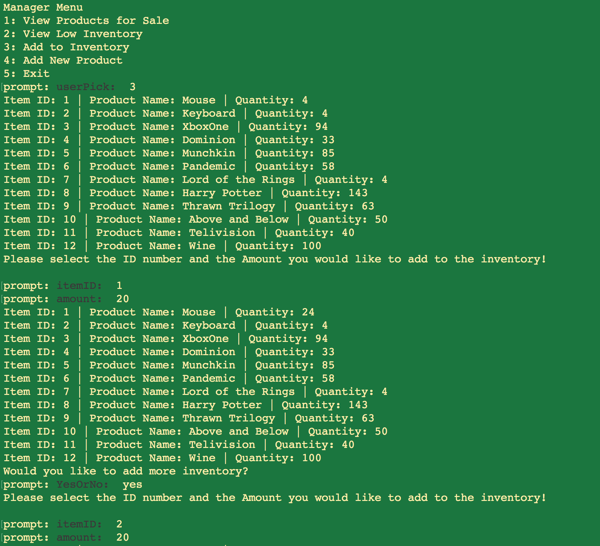
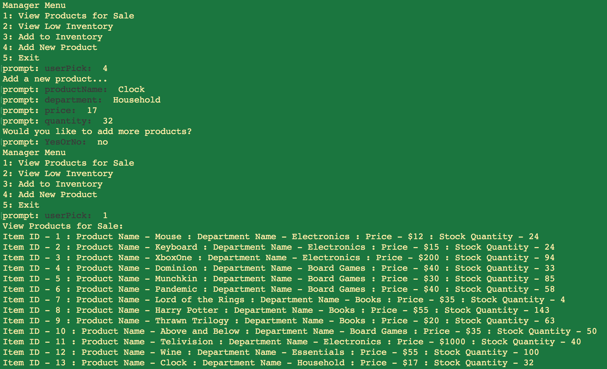

# Bamazon

## Overview

In this activity, I created an Amazon-like storefront with the MySQL and Node.js. The app will take in orders from customers and deplete stock from the store's inventory. The bamazonManager.js program allows the manager to check stock, add stock, and add products.

## Technologies Used

1. Javascript
1. mySQL
1. Node.js
    1. npm Prompt
    1. npm mysql

## Bamazon Customer

With the Bamazon Customer app, you will get a list of products and their cost. Choose the corresponding number and amount you want to order. The app will update the database and show you total amount. 

## Bamazon Manager

The Bamazon Manager app will print out a menu with corresponding numbers, and it will ask you which item you want to choose. If you choose 1, you will be able to view all the products for sale:

If you choose 2, it will show you all products with a quantity less than 5. If there are no products it will tell you that you do not have any low inventory:

If you do have products with a quantity less than 5, it will print out those products:

If you choose 3, it will print out all the products and ask you which item you want to add inventory to. Then it will ask you for the amount you would like to add to the inventory:

If you choose 4, it will add a new product. It will prompt you for the product name, department, price, and quantity:

Finally, if you choose 5, it will exit out of the program. When you pick an item to perform from the menu and complete it, it will go back to the beginning menu.
